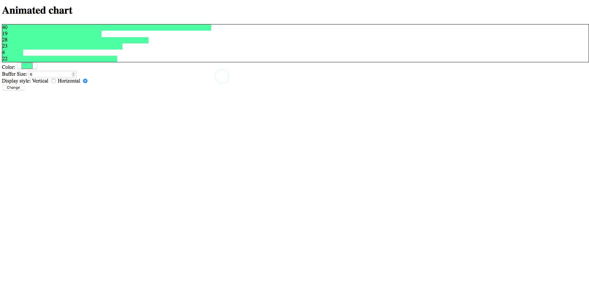

# Animated Chart

A simple web app wherein an animated bar chart that displays
last few values in real time like gif showing below:



## Prerequisites

Please ensure you have the following installed prior to start coding:

* Node.js
* Text Editor
* Git

After you have Node.js installed, you want to run the following command under the
root folder of midterm:

```
npm install
```

## Build

Once you have the dependencies installed, you are ready to hack on!

To build the front end code, you can run:

```
npm run build
```

This will bundle the `src/app.js` and all files imported in the app.js to
`dest/app.bundle.js`
Then, you can import this bundled JavaScript file in your `index.html`

## Testing

To run tests, use the following commands

```
npm test
```

### Developing

Below is a list of file structure provided.
You can use the following code to better understand the overall picture.

```
[I] ✦ ➜ tree animated_chart
animated_chart
├── README.md                    --> instructions
├── demo.gif                     --> a gif showing how project should act
├── index.html                   --> the html, containing form and the chart
├── package.json                 --> meta definition about task and dependencies
├── src                          --> folder you define your source code
│   ├── app.js                   --> entry point, main method
│   ├── models                   --> business model
│   │   └── queue.js             --> buffer queue model
│   ├── tick.js                  --> ticker, should tick every second
│   ├── utils.js                 --> provided utils method to generate random value
│   └── views                    --> view components folder
│       └── chart.js             --> game chart component
├── test                         --> all unit tests
│   ├── __snapshots__
│   │   └── chart.test.js.snap
│   ├── chart.test.js
│   ├── queue.test.js
│   └── tick.test.js
└── webpack.config.js

5 directories, 15 files
```
